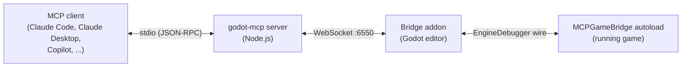

# Architecture

How godot-mcp's three processes fit together, and the design decisions behind them.

## The big picture



Three processes, three links:

1. **MCP client ↔ server.** Standard MCP over stdio. The server (`server/src/`) defines the 15 tools, validates arguments with Zod schemas, and translates tool calls into bridge commands.
2. **Server ↔ editor addon.** A WebSocket on `127.0.0.1:6550` by default. The *addon* is the listener; the *server* is the client that connects to it. The addon (`godot/addons/godot_mcp/`) routes each command through `command_router.gd` to a handler module per domain (scene, node, animation, input, ...).
3. **Editor addon ↔ running game.** No second socket. The addon registers `MCPGameBridge` as an autoload in your project and talks to it over Godot's own debugger protocol — the editor side sends `godot_mcp:`-prefixed debugger messages via an `EditorDebuggerPlugin` (`core/mcp_debugger_plugin.gd`), and the game-side bridge (`game_bridge/mcp_game_bridge.gd`) picks them up with `EngineDebugger.register_message_capture()`. Because it rides the debug wire, the running game needs no extra ports, no network permissions, and no per-project setup.

## Connection lifecycle

The server connects eagerly and assumes the editor may not be there yet:

- **Reconnection** uses exponential backoff: 1s, 2s, 4s, 8s, 16s, then every 30s. You can start the server and the editor in either order.
- **Heartbeats** go out every 30 seconds so the addon can tell a quiet-but-alive client from a dead one.

### One client at a time

The editor bridge serves a single client. When a second client connects while one is active:

- The newcomer is rejected with WebSocket close code `4001` ("another client is already connected") instead of displacing the incumbent — a subagent that inherited your MCP config can't hijack your session mid-edit.
- Rejected clients retry with backoff and connect automatically once the slot frees up.
- If the incumbent goes silent for **45 seconds** (no messages, no heartbeats) or its TCP connection drops, it's considered stale and the next client takes over. A crashed session never permanently wedges the bridge.

This logic lives in `godot/addons/godot_mcp/websocket_server.gd`.

## Deterministic game time

`godot_editor run frozen=true` boots the game with the clock frozen from frame 0, and `godot_game_time` owns the clock from there:

- **freeze / thaw** pause and resume under agent control, layered correctly over the game's *own* pause state — freezing over an open pause menu and thawing back to it preserves the game's intent.
- **step** advances a bounded slice of game time (or an exact frame count), then re-freezes.
- **step_until** re-evaluates a GDScript predicate every frame and stops the frame it holds, with a safety cap so it can't hang.
- Input timelines ride *inside* the step window, so `is_action_just_pressed` edges land on real frames.

The point: between any two tool calls, the game is exactly where the agent left it. Screenshots, state digests, and node queries all work while frozen, so observation never races gameplay.

## WSL support

The standard cross-boundary setup is Godot on Windows with the MCP server inside WSL2:

- **Detection** (`server/src/utils/wsl-detection.ts`): the server checks `WSL_DISTRO_NAME` / `WSL_INTEROP` and falls back to scanning `/proc/version`.
- **Host discovery** (`server/src/utils/host-ip-resolver.ts`): on WSL2 the Windows host IP comes from the nameserver in `/etc/resolv.conf`; on WSL1 it's the default gateway from `/proc/net/route`. `GODOT_HOST` overrides everything.
- **Bind modes** (MCP panel in the editor): the addon defaults to `127.0.0.1`, which WSL traffic can't reach — switch to **WSL** mode to listen on the `vEthernet (WSL)` interface, or **Custom** for any specific IP. Panel settings persist to `project.godot`.

## Security posture

- The addon binds to **localhost by default**; the WebSocket is unencrypted (`ws://`). The other bind modes exist for WSL and trusted-LAN setups — don't point them at interfaces you don't trust.
- `godot_exec` runs GDScript inside the running game behind a static denylist (process spawning, file writes, settings persistence). That denylist is an **accident guard, not a security boundary** — it keeps an agent from absent-mindedly writing to disk, not a sandboxed adversary from escaping.

## Versioning and releases

The server and addon are released together and share one version number:

- [release-please](https://github.com/googleapis/release-please) drives versioning from conventional commits; the release workflow syncs the version into the addon's `plugin.cfg` and regenerates docs.
- The npm package bundles the addon, which is what `npx @satelliteoflove/godot-mcp --install-addon <path>` copies into your project. Each GitHub release also attaches the addon as a zip.
- The MCP panel shows both versions and warns on mismatch.

## Repo layout

```text
server/src/tools/         MCP tool definitions (one file per domain)
server/src/resources/     MCP resource handlers
server/src/connection/    WebSocket client to the editor addon
server/src/installer/     --install-addon implementation
godot/addons/godot_mcp/
  plugin.gd               EditorPlugin entry point; registers the autoload
  websocket_server.gd     WebSocket listener + single-client policy
  command_router.gd       Routes commands to handlers
  commands/               GDScript command handlers (one file per domain)
  core/                   Debugger plugin, logger, shared utilities
  game_bridge/            Runs inside the game: bridge, state sampler, profiler, exec guard
  ui/                     The MCP bottom panel
```

Docs under `docs/tools/`, `docs/resources.md`, and `docs/README.md` are generated from the tool definitions by `npm run generate-docs` — edit the tool schemas, not those files.
